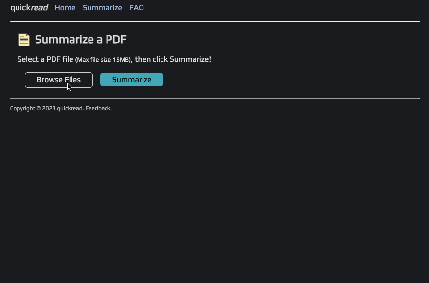

## quickread

quickread is a tool that allows users to upload & summarize PDFs.

The backend is build in Go and the frontend is vanilla HTML/CSS/Javascript.

Check it out here! [https://quickread.fly.dev](https://quickread.fly.dev)

